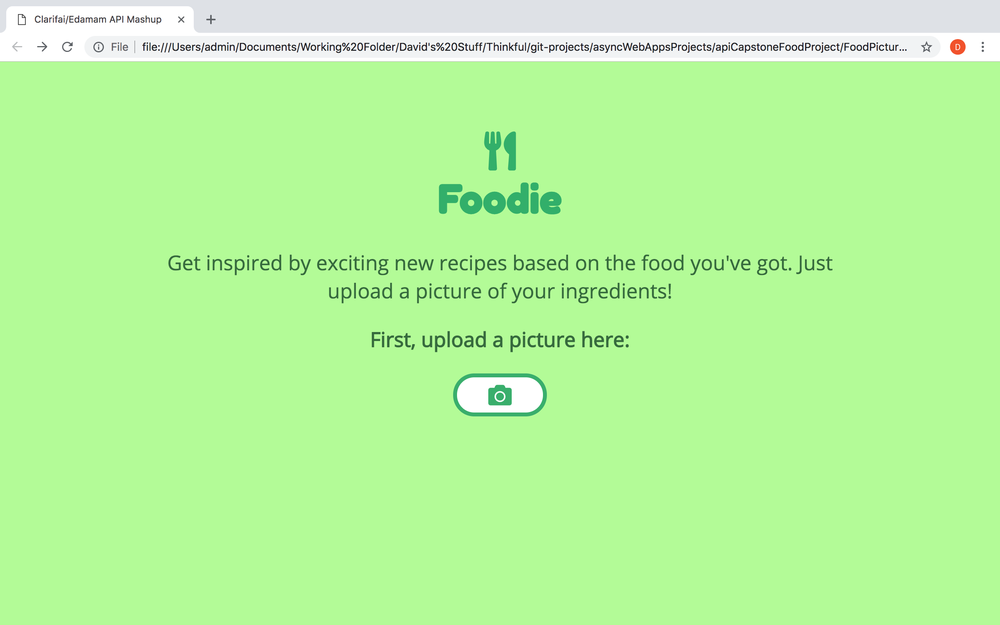
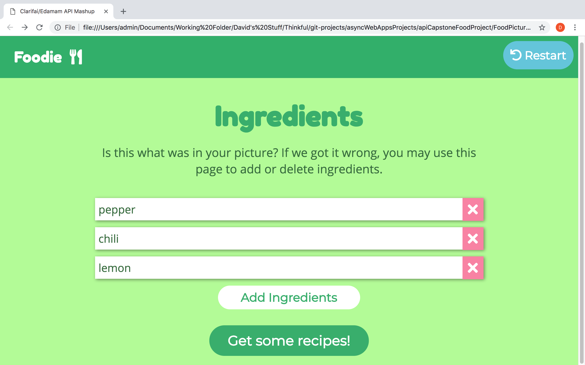

# Foodie

Foodie is an app designed to inspire users with new and exciting recipes based on the food they already have. A user simply snaps a picture of their spare food, and Foodie uses advanced machine learning to predict what food items are in that picture. If the app gets it wrong, users have the ability to correct the list of items that the app returned. When the list of the user's food items is complete, the user then submits the list and the app returns a list of recipes that incorporate the food items from the list.

## Live demo:

- [Link to Foodie app](https://davidshaw512.github.io/Foodie/)

## Screenshots

Title/upload screen:

Ingredients screen:

Recipes screen:

## Built with:

- HTML
- CSS 
- JavaScript 
- jQuery

## Future features/stretch goals:

- Nutritional values displayed on recipe cards
- Show a thumbnail of the user's uploaded picture on the title screen and ingredients screen